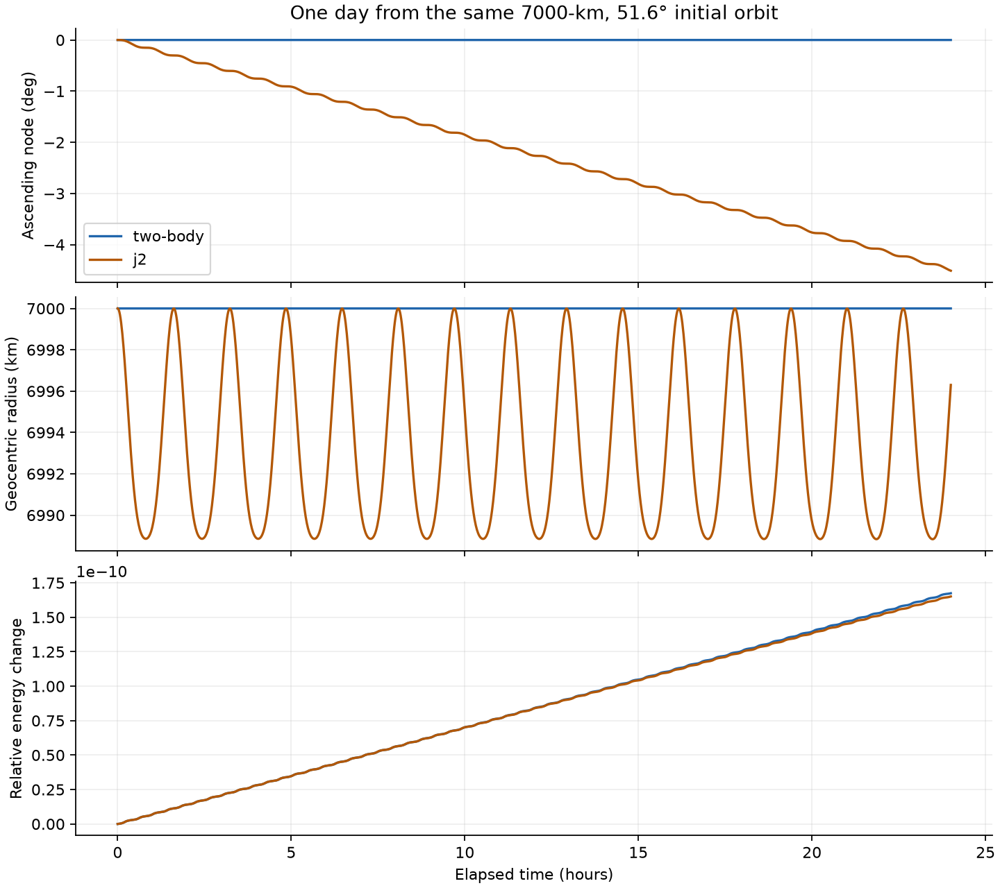

# orbit-access

a ground station only gets a few minutes of contact per pass with a satellite in low earth orbit. in this model's default case that's four passes a day of six to eight minutes each, about half an hour of contact in total, so the pass times need to be predicted accurately. two effects dominate the error: earth's oblateness (J2), which precesses inclined orbit planes, and earth's rotation, which moves the station under the orbit at ~465 m/s at the equator.

orbit-access propagates a satellite state with J2, places a WGS84 station on a rotating earth, and reports every interval above the elevation mask.

```text
state at t0 -> adaptive J2 propagation -> WGS84 station + earth rotation
            -> elevation above mask -> bracket -> bisect -> pass
```

the default run (circular orbit, 7,000 km radius, 51.6° inclination, station at 1.35° N 103.82° E) finds four passes above 10° in one day: 390.278, 449.958, 455.508 and 404.475 s. these are outputs of this model, not predictions for a real spacecraft.



## design

the force model is central gravity plus J2 ([dynamics.cpp](src/dynamics.cpp)), integrated with Dormand-Prince 5(4) using separate absolute tolerances for position and velocity (1e-8 km, 1e-11 km/s). the propagator either reaches the requested time or throws; it never returns a partial trajectory.

with J2 enabled, energy and the z component of angular momentum are conserved but the full angular momentum vector is not. that determines which conservation checks are valid tests of the integrator ([numerics.md](docs/numerics.md)).

the station's local vertical is the WGS84 ellipsoid normal rather than the geocentric direction, rotated into the inertial frame with an explicit Greenwich angle. passes are found by sampling elevation every 10 s and bisecting each visibility change to 1e-5 s, re-propagating from the same left endpoint each time instead of interpolating elevation. a grazing pass shorter than the sample step can still be missed, and the documentation says so.

## verification

150 elliptic two-body propagations against an independent Kepler solver (under 0.5 m and 0.5 mm/s), long-run conservation, the J2 acceleration against a numerical potential gradient, node drift within 1% of first-order secular theory, analytic rise and set times, and an identical pass list when the sample step drops from 31 s to 7 s. [ci](.github/workflows/check.yml) runs the suite under asan and ubsan.

```sh
cmake -S . -B build -DCMAKE_BUILD_TYPE=Release && cmake --build build
ctest --test-dir build --output-on-failure
./build/orbit-access passes 86400 1.3521 103.8198 10 j2
```

not modelled: drag, lunar and solar gravity, utc and polar motion, refraction. it's a tool for examining the numerics and geometry, not for operational contact scheduling.
